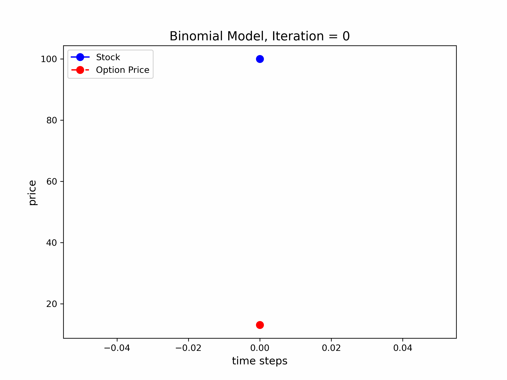

# OptionsPricer

**OptionsPricer** is a C++ project that implements options pricing models for the **European**, **American**, and **Bermuda** options, supporting both **call** and **put** options. The project provides accurate option prices using the **Black-Scholes formula** for European options, the **binomial tree method** for American options, and Bermuda options with support for early exercise at specific dates.


<div style="display: flex; justify-content: center;">
  
  
</div>


## Table of Contents
- [Introduction](#introduction)
- [Option Types](#option-types)
  - [European Options](#european-options)
  - [American Options](#american-options)
  - [Bermuda Options](#bermuda-options)
- [Pricing Models](#pricing-models)
  - [Black-Scholes Formula (European)](#black-scholes-formula-european)
  - [Binomial Tree Model (American & Bermuda)](#binomial-tree-model-american-and-bermuda)
- [Installation](#installation)
- [Usage](#usage)

## Introduction
`OptionPricer` implements financial options pricing for three types of options: European, American, and Bermuda. The primary difference between these options lies in their exercise features:
- **European options** can only be exercised at maturity.
- **American options** allow early exercise at any point before maturity.
- **Bermuda options** allow early exercise, but only on specific predetermined dates.

Both call and put options are supported in this library.

## Option Types

### European Options
A **European option** can only be exercised at the end of its maturity. Pricing is based on the Black-Scholes formula, which provides an analytical solution for the option's value.

### American Options
An **American option** can be exercised at any time before maturity. Pricing uses a binomial tree model, which simulates possible price movements and computes the option value at each step, allowing for early exercise.

### Bermuda Options
A **Bermuda option** allows early exercise, but only on predetermined dates before maturity. These exercise dates are set at specific intervals (e.g., quarterly). The pricing for Bermuda options uses a binomial tree similar to American options, but early exercise is only considered on the allowed dates.

## Pricing Models

### Black-Scholes Formula (European)
The Black-Scholes formula provides an exact solution for European option prices, based on the following parameters:
- **S**: Underlying asset price
- **K**: Strike price
- **T**: Time to maturity
- **r**: Risk-free rate
- **σ**: Volatility

The formula for a **European Call** option is:

$$
C = S \cdot N(d_1) - K e^{-rT} N(d_2)
$$

where: 

$$
d_1 = \frac{\log(S/K) + (r + 0.5 \sigma^2)T}{\sigma \sqrt{T}}, \quad d_2 = d_1 - \sigma \sqrt{T}
$$

And $$N(x)$$ is the cumulative normal distribution function.

For a **European Put**, the formula becomes:

$$
P = K \cdot e^{-rT} N(-d_2) - S \cdot N(-d_1)
$$

### Binomial Tree Model (American and Bermuda)
The binomial tree method is used to calculate the price of American and Bermuda options, which accounts for early exercise. The option price is determined by simulating the price evolution of the underlying asset over discrete time steps.

At each node in the tree:
- The price can go **up** by a factor of $$u = e^{\sigma \sqrt{\Delta t}}$$
- The price can go **down** by a factor of $$d = \frac{1}{u}$$
- The **risk-neutral probability** of an up move is $$p = \frac{e^{r \Delta t} - d}{u - d}$$

At each step, the option's value is calculated as:

$$
V = \max(\text{payoff}, e^{-r \Delta t}\cdot ( p \times V_{\text{up}} + (1 - p) \times V_{\text{down}}))
$$

For **American options**, early exercise is allowed at every time step, meaning the option holder can decide to exercise early if the intrinsic value exceeds the expected holding value.

For **Bermuda options**, early exercise is only allowed on specific predetermined dates (e.g., quarterly intervals). On those exercise dates, the model checks if exercising the option early is more valuable than holding it.

## Installation
1. Clone this repository:
   ```bash
   git clone https://github.com/honglizhaobob/OptionPricer.git
   ```
2. Navigate to the project directory:
   ```bash
   cd OptionsPricer
   ```
3. Compile the project:
   ```bash
   g++ main.cpp -o OptionPricer
   ```

## Usage
After compiling, you can run the program to price European, American, and Bermuda options:

```bash
./OptionsPricer
```

### Sample Outputs
```
===========================
      Option Properties     
===========================
Option Type:     Call
Strike Price:    100
Underlying Price:105
Maturity:        1 year(s)
Risk-Free Rate:  5%
Volatility:      20%
===========================
European Call Option Price = 10.4506

===========================
      Option Properties     
===========================
Option Type:     Put
Strike Price:    100
Underlying Price:105
Maturity:        1 year(s)
Risk-Free Rate:  5%
Volatility:      20%
===========================
European Put Option Price = 2.4596
```

## License
This project is licensed under the MIT License.
